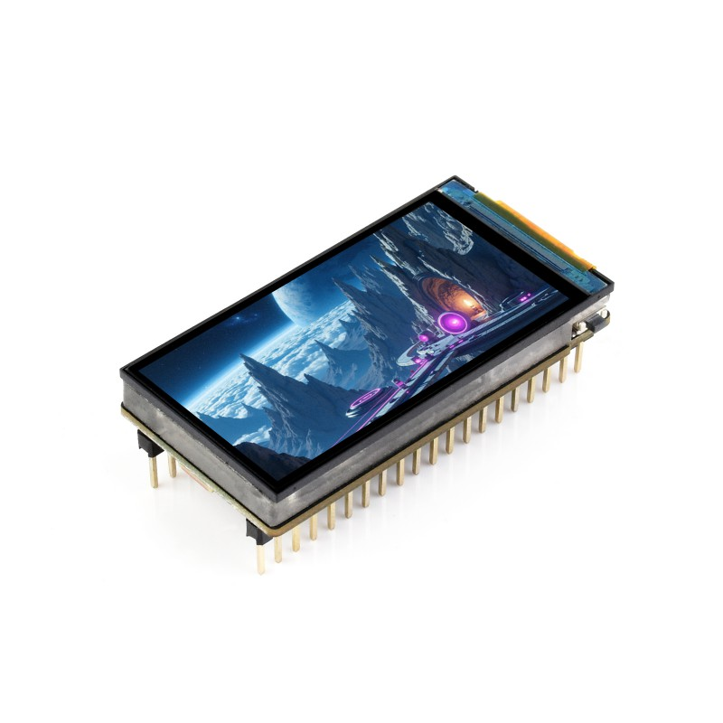

# OpenGripBoard Firmware
Firmware for the various OpenGripBoard microcontroller

## Supported microcontrollers
### ESP32-C6-LCD-1.9


[waveshare wiki](https://www.waveshare.com/esp32-c6-lcd-1.9.htm)

## Features

- [ ] Standalone weight recording
- [ ] Multi language support (de & en)
- [ ] Display QR-Code for companion app


## Developer setup

### Required tools

- Rust [install with rustup](rustup.rs)
- Add rust target
```bash
rustup target add riscv32imac-unknown-none-elf # For ESP32-C6 and ESP32-H2
```
- Install Espflash
```bash
cargo install espflash --locked
```
- Install ldproxy
```bash
cargo install ldproxy
```


### Flash on microcontroller

```bash
cargo run
```